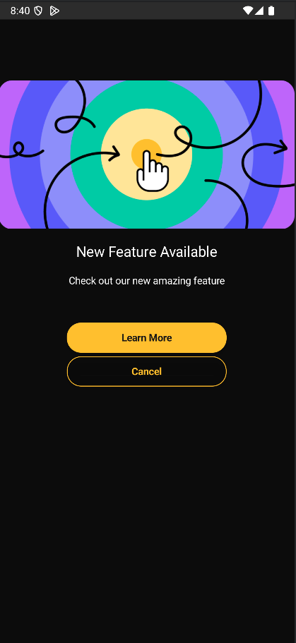
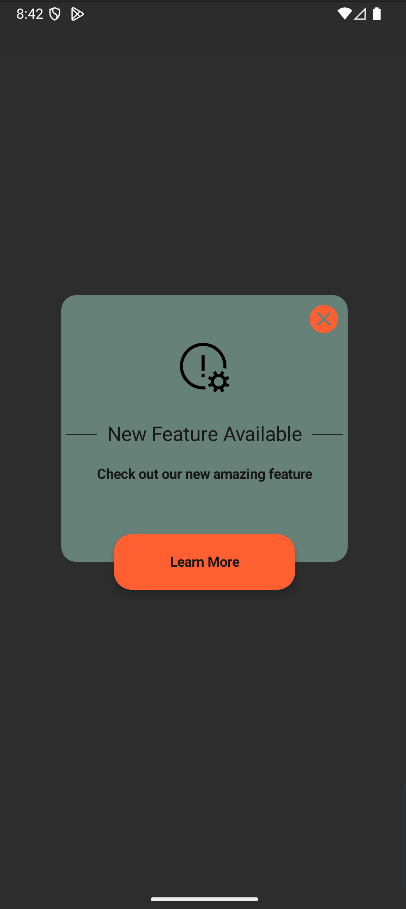
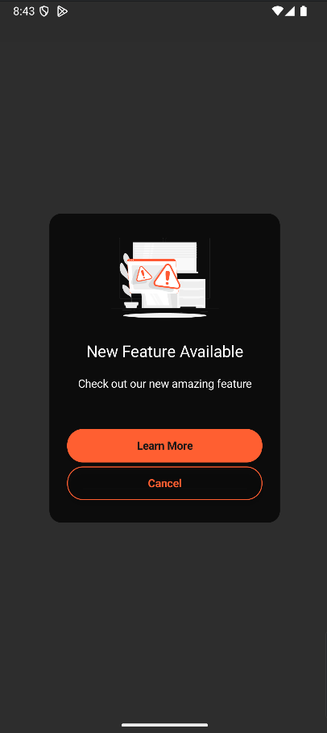
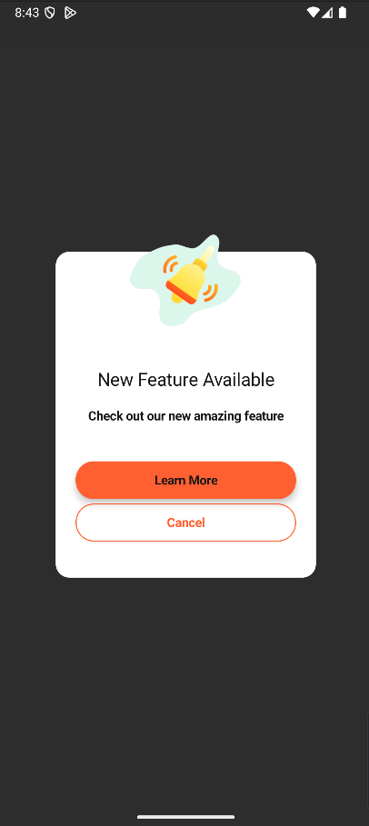
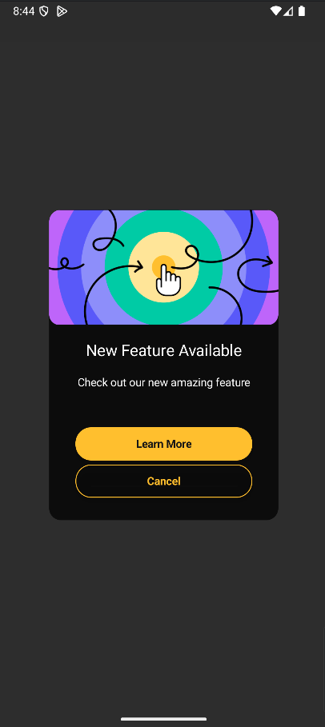

# LaunchAlertKit 📱

[](https://jitpack.io/#ControlKit/LaunchAlertKit-Android)
[](LICENSE)
[](https://android-arsenal.com/api?level=21)

A powerful and customizable Android library for managing launch alerts in your applications. Built with Jetpack Compose and modern Android architecture patterns.

## ✨ Features

- 🎨 **5 Beautiful UI Styles** - FullScreen and Popover variants
- 🌍 **Multi-language Support** - Localized content support
- 🔧 **Highly Customizable** - Customize every aspect of the UI
- 🏗️ **Modern Architecture** - MVVM with Repository pattern
- 🧪 **Well Tested** - Comprehensive unit and UI tests
- 📊 **Analytics Ready** - Built-in action tracking (VIEW, CONFIRM)
- 🚀 **Easy Integration** - Simple setup with minimal code
- 💪 **Error Handling** - Robust error management with retry mechanisms
- 🔄 **Smart UUID Management** - Prevent duplicate alert displays

## 📦 Installation

Add the JitPack repository to your project's `build.gradle`:

```gradle
allprojects {
    repositories {
        maven { url 'https://jitpack.io' }
    }
}
```

Add the dependency to your app's `build.gradle`:

```gradle
dependencies {
    implementation 'com.github.ControlKit:LaunchAlertKit-Android:0.0.1'
}
```

## 🚀 Quick Start

### Basic Usage

```kotlin
import com.sepanta.controlkit.launchalertkit.LaunchAlertKit
import com.sepanta.controlkit.launchalertkit.config.LaunchAlertServiceConfig
import com.sepanta.controlkit.launchalertkit.view.config.LaunchAlertViewConfig
import com.sepanta.controlkit.launchalertkit.view.config.LaunchAlertViewStyle

@Composable
fun MyApp() {
    val kit = LaunchAlertKit.configure(
        context = LocalContext.current,
        config = LaunchAlertServiceConfig(
            version = "1.0.0",
            appId = "your-app-id",
            deviceId = "unique-device-id",
            lang = "en"
        )
    )
    
    // Display LaunchAlert
    LaunchAlertView(
        config = LaunchAlertViewConfig(
            launchAlertViewStyle = LaunchAlertViewStyle.FullScreen1
        )
    )
}
```

## 🎨 UI Styles

LaunchAlertKit provides 5 different UI styles to match your app's design:

### FullScreen Styles

#### FullScreen1 - Clean & Minimal

- Full-screen overlay with dark background
- Large image display (216dp height)
- Centered content layout
- Yellow submit button with transparent cancel button

### Popover Styles

#### Popover1 - Overlapping Button Style

- Green background with rounded corners
- Image with title and description
- Overlapping submit button (offset by -28dp)
- Close button in top-right corner

#### Popover2 - Standard Popup Style

- Dark background with rounded corners
- Standard button layout (submit and cancel)
- Full-width buttons with proper spacing
- Orange color scheme

#### Popover3 - Alternative Popup Style

- Alternative layout with different spacing
- Customizable colors and dimensions
- Flexible button positioning

#### Popover4 - Modern Popup Style

- Modern design with enhanced visuals
- Optimized for mobile devices
- Clean and minimal interface

## ⚙️ Configuration

### Service Configuration

```kotlin
LaunchAlertServiceConfig(
    // Required
    version = "1.0.0",                    // Current app version
    appId = "your-app-id",                // Unique app identifier
    deviceId = "device-id",               // Device identifier
    
    // Optional
    timeOut = 30000L,                     // API timeout in milliseconds
    maxRetry = 3,                         // Maximum retry attempts
    lang = "en"                           // Language code
)
```

### View Configuration

```kotlin
LaunchAlertViewConfig(
    // Style Selection
    launchAlertViewStyle = LaunchAlertViewStyle.FullScreen1,
    
    // Image Configuration
    imageDrawble = R.drawable.alert_icon,     // Custom image resource
    placeholderImageDrawble = R.drawable.placeholder,
    errorImageDrawble = R.drawable.error_icon,
    contentScaleImageDrawble = ContentScale.Fit,
    
    // Layout Modifiers
    popupViewLayoutModifier = Modifier.fillMaxSize(),
    popupViewBackGroundColor = Color.White,
    popupViewCornerRadius = 16.dp,
    
    // Text Content
    headerTitle = "Welcome to Our App",
    descriptionTitle = "We're excited to have you! Please read our terms and conditions.",
    submitButtonTitle = "Continue",
    cancelButtonTitle = "Cancel",
    
    // Colors
    headerTitleColor = Color.Black,
    descriptionTitleColor = Color.Gray,
    submitButtonColor = Color.Blue,
    cancelButtonColor = Color.Gray
)
```

## 🔧 Advanced Usage

### Custom Image Loading

```kotlin
LaunchAlertViewConfig(
    imageView = { imageUrl ->
        AsyncImage(
            model = imageUrl,
            contentDescription = "Alert image",
            modifier = Modifier
                .size(200.dp)
                .clip(RoundedCornerShape(16.dp)),
            contentScale = ContentScale.Crop,
            placeholder = painterResource(R.drawable.placeholder),
            error = painterResource(R.drawable.error_icon)
        )
    }
)
```

### Custom Button Design

```kotlin
LaunchAlertViewConfig(
    submitButtonView = { onClick ->
        Row(
            modifier = Modifier.fillMaxWidth(),
            horizontalArrangement = Arrangement.spacedBy(16.dp)
        ) {
            OutlinedButton(
                onClick = { /* Handle cancel */ },
                modifier = Modifier.weight(1f)
            ) {
                Text("Later")
            }
            Button(
                onClick = onClick,
                modifier = Modifier.weight(1f),
                colors = ButtonDefaults.buttonColors(
                    containerColor = Color(0xFF4CAF50)
                )
            ) {
                Text("Continue")
            }
        }
    }
)
```

### Custom Text Views

```kotlin
LaunchAlertViewConfig(
    headerTitleView = { title ->
        Text(
            text = title,
            style = MaterialTheme.typography.headlineMedium,
            color = MaterialTheme.colorScheme.primary,
            textAlign = TextAlign.Center
        )
    },
    descriptionTitleView = { description ->
        Text(
            text = description,
            style = MaterialTheme.typography.bodyLarge,
            color = MaterialTheme.colorScheme.onSurface,
            textAlign = TextAlign.Center,
            lineHeight = 24.sp
        )
    }
)
```

### Error Handling

```kotlin
val kit = LaunchAlertKit.configure(
    context = LocalContext.current,
    config = LaunchAlertServiceConfig(
        // ... your config
        maxRetry = 3,          // Number of retry attempts
        timeOut = 30000L       // API timeout
    )
)

// Handle states
when (state) {
    is LaunchAlertState.ShowViewError -> {
        // Handle network or API errors
        Log.e("LaunchAlert", "Error: ${state.data?.message}")
    }
    is LaunchAlertState.ActionError -> {
        // Error during action
        Log.e("LaunchAlert", "Action error: ${state.data?.message}")
    }
    is LaunchAlertState.NoAlert -> {
        // No alert to show
        Log.i("LaunchAlert", "No alert available")
    }
}
```

### Multi-language Support

```kotlin
LaunchAlertServiceConfig(
    // ... other config
    lang = "fa"  // Persian
    // lang = "ar"  // Arabic
    // lang = "en"  // English
)
```

## 📊 State Management

The library provides comprehensive state management through `LaunchAlertState`:

```kotlin
sealed class LaunchAlertState {
    object Initial                    // Initial state
    object NoAlert                   // No alert available
    data class Action(val data: String)           // Action completed
    data class ActionError(val data: ApiError<*>?) // Action error
    data class ShowView(val data: CheckUpdateResponse?)           // Show alert dialog
    data class ShowViewError(val data: ApiError<*>?)             // Show error dialog
}
```

## 🔌 API Integration

The library integrates with your backend API. The base URL is configurable through `local.properties`:

```properties
# local.properties
API_URL="https://your-api-domain.com/api/launch-alerts"
```

- **Check Alert**: `GET /launch-alerts`
- **Send Action**: `POST /launch-alerts/{id}`

### API Parameters

```kotlin
// Check Alert Request
GET /launch-alerts
Headers:
  - x-app-id: {appId}
  - x-version: {version}
  - x-sdk-version: {sdkVersion}
  - x-device-uuid: {deviceId}

// Send Action Request
POST /launch-alerts/{id}
Headers:
  - x-app-id: {appId}
  - x-version: {version}
  - x-sdk-version: {sdkVersion}
  - x-device-uuid: {deviceId}
Body:
  - action: "VIEW" | "CONFIRM"
```

### Response Format

```json
{
    "data": {
        "id": "alert-id",
        "title": [
            {"language": "en", "content": "Welcome to Our App"},
            {"language": "fa", "content": "به اپلیکیشن ما خوش آمدید"}
        ],
        "description": [
            {"language": "en", "content": "We're excited to have you!"},
            {"language": "fa", "content": "از حضور شما خوشحالیم!"}
        ],
        "force": false,
        "icon": "https://example.com/icon.png",
        "link": "https://example.com/terms",
        "button_title": [
            {"language": "en", "content": "Continue"},
            {"language": "fa", "content": "ادامه"}
        ],
        "cancel_button_title": [
            {"language": "en", "content": "Cancel"},
            {"language": "fa", "content": "لغو"}
        ]
    }
}
```

## 🧪 Testing

The library includes comprehensive testing:

```kotlin
// Unit Tests
testImplementation 'junit:junit:4.13.2'
testImplementation 'io.mockk:mockk:1.14.5'
testImplementation 'app.cash.turbine:turbine:1.2.1'

// UI Tests
androidTestImplementation 'androidx.test.ext:junit:1.2.1'
androidTestImplementation 'androidx.test.espresso:espresso-core:3.6.1'
```

## 📱 Requirements

- **Minimum SDK**: 21 (Android 5.0)
- **Target SDK**: 36 (Android 14)
- **Kotlin**: 1.8.0+
- **Jetpack Compose**: 1.4.0+

## 🔒 Permissions

Add to your `AndroidManifest.xml`:

```xml
<uses-permission android:name="android.permission.INTERNET" />
```

## 🎯 Best Practices

### 1. Version Management
```kotlin
// Use semantic versioning
version = "1.2.3"  // Major.Minor.Patch
```

### 2. Device ID Generation
```kotlin
// Generate unique device ID
val deviceId = Settings.Secure.getString(
    contentResolver,
    Settings.Secure.ANDROID_ID
)
```

### 3. Error Handling
```kotlin
// Always handle errors gracefully
when (state) {
    is LaunchAlertState.ShowViewError -> {
        // Show user-friendly error message
        showErrorDialog("Unable to load alert. Please try again later.")
    }
    // ... other states
}
```

### 4. Customization
```kotlin
// Match your app's theme
LaunchAlertViewConfig(
    popupViewBackGroundColor = MaterialTheme.colorScheme.surface,
    submitButtonColor = MaterialTheme.colorScheme.primary,
    headerTitleColor = MaterialTheme.colorScheme.onSurface
)
```

## 🤝 Contributing

We welcome contributions! Please see our [Contributing Guidelines](CONTRIBUTING.md) for details.

## 📄 License

This project is licensed under the MIT License - see the [LICENSE](LICENSE) file for details.

## 🆘 Support

- 📧 Email: support@controlkit.com
- 🐛 Issues: [GitHub Issues](https://github.com/ControlKit/LaunchAlertKit-Android/issues)
- 📖 Documentation: [Wiki](https://github.com/ControlKit/LaunchAlertKit-Android/wiki)

## 🙏 Acknowledgments

- Built with ❤️ using Jetpack Compose
- Inspired by modern Android development practices
- Thanks to all contributors and the Android community

---

**Made with ❤️ by ControlKit Team**